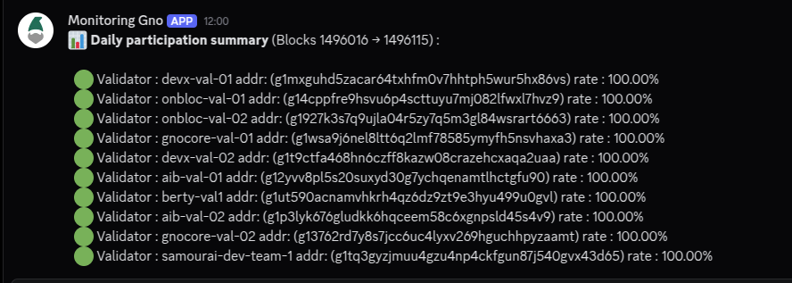

# 🛠️ Monitoring Gnoland Validators

This repository provides lightweight tools to monitor the [Gnoland](https://gno.land) blockchain and its validators.

Two services are available:

- **Block Exporter:** Tracks missed blocks from a specific Gnoland validator. It exposes [Prometheus](https://prometheus.io/) metrics, enabling [Grafana](https://grafana.com/) dashboards and alerts.

- **GnolandStatus:** Monitors the overall validator set, calculates participation rates over a sliding block window, and sends alerts to Discord if a validator’s rate drops below 100%. Also exposes Prometheus metrics.

---

## 🚀 Block Exporter


### Requirements

- [Docker](https://www.docker.com/)
- [Docker Compose](https://docs.docker.com/compose/)

First, you need to configure the YAML configuration file :

```bash
cd block_exporter
cp config.yaml.template config.yaml 
nano config.yaml
```

You must specify your validator's address, and it's also possible to change the RPC service address.

```yaml
rpc_endpoint: "https://rpc.test6.testnets.gno.land"
validator_address: "replace with your validator address"
port: 8888
```

Start the container:

```bash
docker compose up -d 
```

And now, at the URL <http://localhost:8888/metrics>, you can view the following metrics:

- `gnoland_missed_blocks`
- `gnoland_consecutive_missed_blocks`

---

## 📊 GnolandStatus

### Requirements

- [Docker](https://www.docker.com/)
- [Docker Compose](https://docs.docker.com/compose/)



First, you need to configure the YAML configuration file :

``` bash
cd Gnolandstatus 
cp config.yaml.template config.yaml 
nano config.yaml
```

You must provide the Discord webhook URL. You can adjust the other parameters as you wish.
Window size is the size of the sliding window used to calculate the participation rate.

```yaml
rpc_endpoint: "https://rpc.test6.testnets.gno.land"
discord_webhook_url : ""
windows_size : 100 
daily_report_hour: 16 
daily_report_minute: 0
metrics_port: 8888
```

Now you just need to start the Docker container:

```bash
docker compose up -d 
```

And now, at the URL <http://localhost:8888/metrics>, you can view the following metrics:


- `gnoland_validator_participation_rate{moniker="samourai-dev-team-1",validator_address="g1tq3gyzjmuu4gzu4np4ckfgun87j540gvx43d65"} 100`
- `gnoland_block_window_start_height 100`
- `gnoland_block_window_end_height 199`
